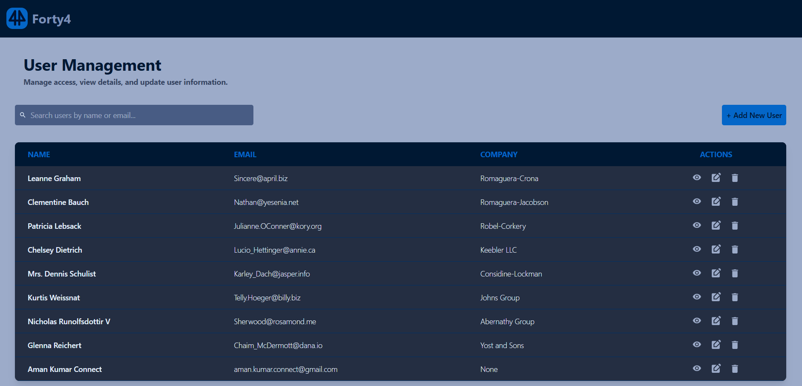
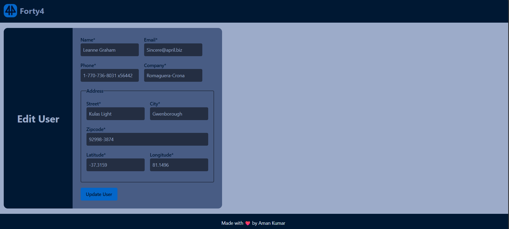

# User Management Dashboard

## Objective

Build a full-stack web app where users can be added, viewed, edited, and deleted from a dashboard. The app is built using React.js (frontend) and Node.js with Express (backend), connected to a MongoDB database.

## Screenshots

### Dashboard



### Add User


### View User


### Edit User



## Setup Instructions

### Backend Setup

1. Navigate to the backend directory:
   ```bash
   cd backend
   ```
2. Install dependencies:
   ```bash
   npm install
   ```
3. Create a `.env` file in the `backend` directory and add your MongoDB URI and Port:
   ```env
   PORT=5000
   MONGO_URI=your_mongodb_connection_string
   ```
4. Start the server:
   ```bash
   npm run dev
   ```
   The server will run on `http://localhost:5000`.

### Frontend Setup

1. Navigate to the frontend directory:
   ```bash
   cd frontend
   ```
2. Install dependencies:
   ```bash
   npm install
   ```
3. Start the development server:
   ```bash
   npm run dev
   ```
   The application will run on `http://localhost:5173`.

## Tech Stack

### Frontend

- **React.js** (Vite)
- **React Router** (Routing)
- **Axios** (HTTP Client)
- **Tailwind CSS** (Styling)
- **React Icons** (Icons)

### Backend

- **Node.js**
- **Express.js**
- **MongoDB** (Database)
- **Mongoose** (ODM)
- **Cors** (Cross-Origin Resource Sharing)
- **Dotenv** (Environment Variables)

## Core Features

### Frontend

1. **Dashboard**: View a list of all users.
2. **Add User**: Form to create a new user with validation.
3. **View User**: Detailed view of a specific user.
4. **Edit User**: Update existing user details.
5. **Delete User**: Remove a user from the system.
6. **Responsive UI**: Built with Tailwind CSS for a clean and responsive design.
7. **Client-side Validation**: Ensures required fields and valid data formats.

### Backend

1. **RESTful API**:
   - `GET /api/users`: Return all users.
   - `GET /api/users/:id`: Return a single user by ID.
   - `POST /api/users`: Create a new user.
   - `PUT /api/users/:id`: Update a user's details.
   - `DELETE /api/users/:id`: Delete a user.
2. **Data Storage**: Stores Name, Email, Phone, Company, and Address (Street, City, Zip, Geo).
3. **Server-side Validation**: Handles errors and validates input data.

## API Endpoints

| Method   | Endpoint         | Description         |
| :------- | :--------------- | :------------------ |
| `GET`    | `/api/users`     | Get all users       |
| `POST`   | `/api/users`     | Create a new user   |
| `GET`    | `/api/users/:id` | Get user by ID      |
| `PUT`    | `/api/users/:id` | Update user details |
| `DELETE` | `/api/users/:id` | Delete a user       |

## Project Structure

```
Forty4_Assignment/
├── backend/                
│   ├── config/             
│   ├── controllers/        
│   ├── models/             
│   ├── routes/             
│   ├── index.js            
│   └── package.json
├── frontend/               
│   ├── public/
│   ├── src/
│   │   ├── assets/
│   │   ├── components/     
│   │   ├── context/        
│   │   ├── pages/         
│   │   ├── App.jsx
│   │   └── main.jsx
│   ├── index.html
│   ├── vite.config.js
│   └── package.json
├── images/           
└── README.md            
```
